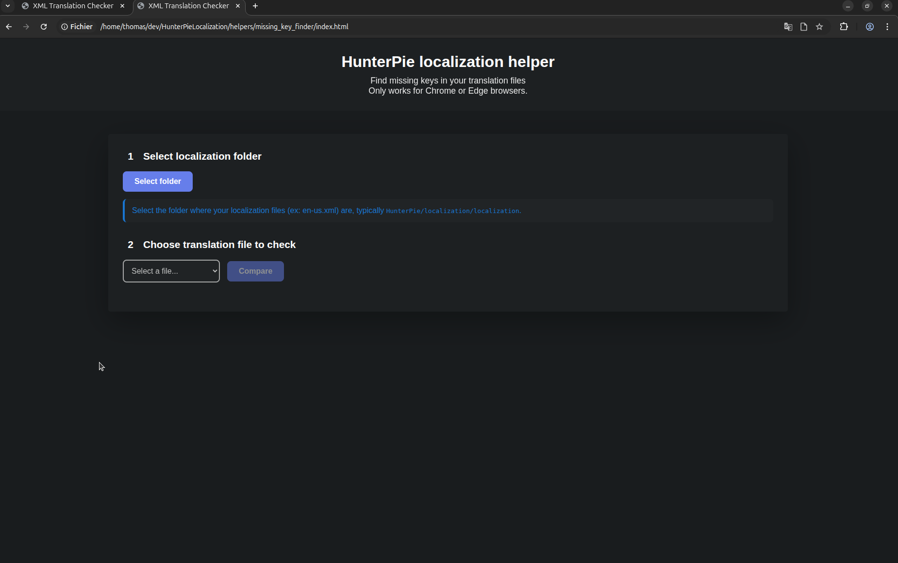
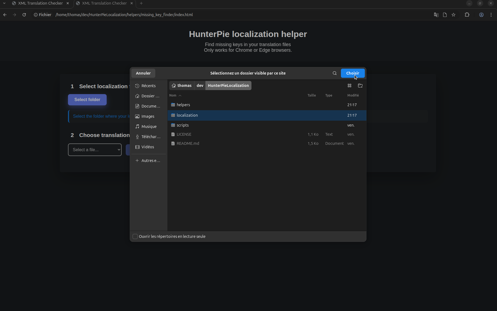
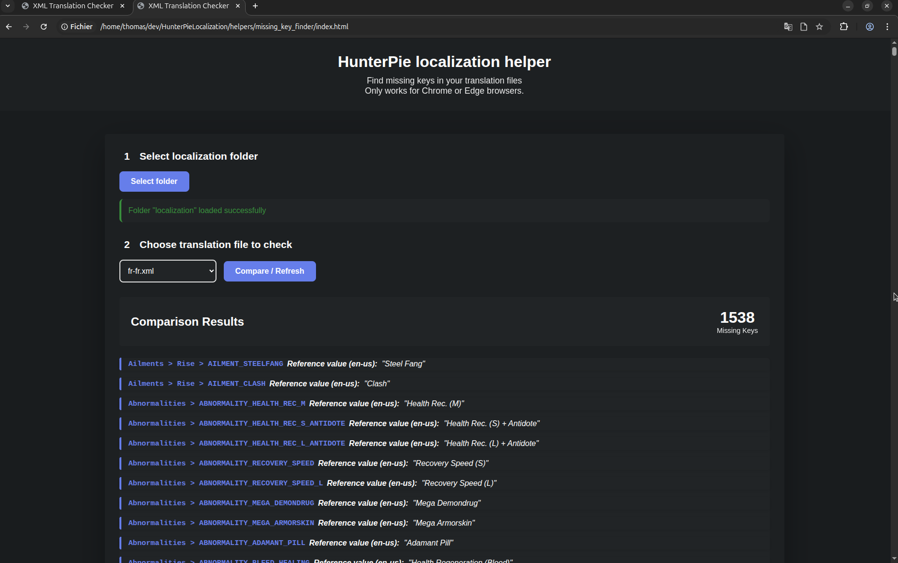

# Localization Helper "Missing key finder"

This helpers aims to list all missing localization entries in a given localization file.
It is 100% web client code which means the only requirement to use it is a compatible browser, allowing any hunter willing to help to access a full list of missing localization keys. Also, it does not send any data to any server.

## Usage

### Requirements : Chrome or Edge

1. Open the index.html in a compatible web browser.
2. Select the folder containing your localization files (typically `HunterPie/localization/localization`).
3. Select the localization files you wish to check
4. Browse throught the keys

### Screenshots

### Demo video

## Tech note

This project relies on the [File System Access API](https://caniuse.com/native-filesystem-api) to access local files, so it can load multiple files at once and refresh the page instantly. Also, it allows the web page to detect new localizations without any code update.
The API can be a bit controversial, but since we only use it for basic file reading, it should be an appropriate and safe use case.
